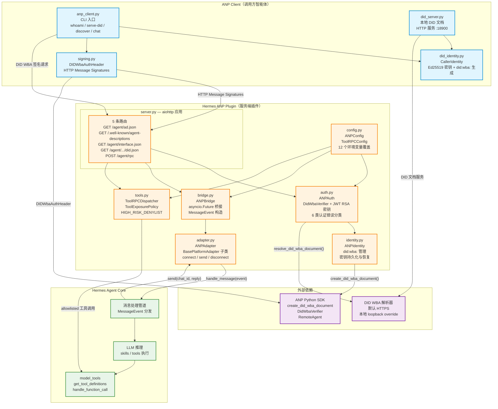

# 组件架构图

```mermaid
graph TD
    %% ========== 样式定义 ==========
    classDef client fill:#e1f5fe,stroke:#0288d1,stroke-width:2px
    classDef plugin fill:#fff3e0,stroke:#f57c00,stroke-width:2px
    classDef hermes fill:#e8f5e9,stroke:#388e3c,stroke-width:2px
    classDef external fill:#f3e5f5,stroke:#7b1fa2,stroke-width:2px

    %% ========== ANP Client（调用方智能体） ==========
    subgraph CLIENT["ANP Client（调用方智能体）"]
        direction TB
        CLI[anp_client.py<br/>CLI 入口<br/>whoami / serve-did / discover / chat]
        DID_ID[did_identity.py<br/>CallerIdentity<br/>Ed25519 密钥 + did:wba: 生成]
        SIGN[signing.py<br/>DIDWbaAuthHeader<br/>HTTP Message Signatures]
        DID_SRV[did_server.py<br/>本地 DID 文档<br/>HTTP 服务 :18900]

        CLI --> DID_ID
        CLI --> SIGN
        DID_SRV --> DID_ID
    end

    %% ========== Hermes ANP Plugin（服务端插件） ==========
    subgraph PLUGIN["Hermes ANP Plugin（服务端插件）"]
        direction TB

        subgraph SERVER["server.py — aiohttp 应用"]
            ROUTES["5 条路由<br/>GET /agent/ad.json<br/>GET /.well-known/agent-descriptions<br/>GET /agent/interface.json<br/>GET /agent/.../did.json<br/>POST /agent/rpc"]
        end

        AUTH[auth.py<br/>ANPAuth<br/>DidWbaVerifier + JWT RSA 密钥<br/>6 类认证错误分类]
        BRIDGE[bridge.py<br/>ANPBridge<br/>asyncio.Future 桥接<br/>MessageEvent 构造]
        ADAPTER[adapter.py<br/>ANPAdapter<br/>BasePlatformAdapter 子类<br/>connect / send / disconnect]
        IDENTITY[identity.py<br/>ANPIdentity<br/>did:wba: 管理<br/>密钥持久化与恢复]
        CONFIG[config.py<br/>ANPConfig<br/>ToolRPCConfig<br/>12 个环境变量覆盖]
        TOOLS[tools.py<br/>ToolRPCDispatcher<br/>ToolExposurePolicy<br/>HIGH_RISK_DENYLIST]

        ROUTES --> AUTH
        ROUTES --> BRIDGE
        ROUTES --> TOOLS
        BRIDGE --> ADAPTER
        AUTH --> IDENTITY
        CONFIG --> AUTH
        CONFIG --> BRIDGE
        CONFIG --> TOOLS
    end

    %% ========== Hermes Agent Core ==========
    subgraph HERMES["Hermes Agent Core"]
        direction TB
        MSG[消息处理管道<br/>MessageEvent 分发]
        LLM[LLM 推理<br/>skills / tools 执行]
        MT[model_tools<br/>get_tool_definitions<br/>handle_function_call]

        MSG --> LLM
        LLM --> MT
    end

    %% ========== 外部 ==========
    subgraph EXT["外部依赖"]
        ANP_SDK[ANP Python SDK<br/>create_did_wba_document<br/>DidWbaVerifier<br/>RemoteAgent]
        DID_RESOLVER[DID WBA 解析器<br/>默认 HTTPS<br/>本地 loopback override]
    end

    %% ========== 跨层连线 ==========
    CLI -->|"DID WBA 签名请求"| ROUTES
    SIGN -->|"HTTP Message Signatures"| ROUTES
    DID_SRV -->|"DID 文档服务"| DID_RESOLVER

    ADAPTER -->|"handle_message(event)"| MSG
    MSG -->|"send(chat_id, reply)"| ADAPTER

    TOOLS -->|"allowlisted 工具调用"| MT

    AUTH -->|"resolve_did_wba_document()"| DID_RESOLVER
    IDENTITY -->|"create_did_wba_document()"| ANP_SDK
    SIGN -->|"DIDWbaAuthHeader"| ANP_SDK

    %% ========== 应用样式 ==========
    class CLI,DID_ID,SIGN,DID_SRV client
    class ROUTES,AUTH,BRIDGE,ADAPTER,IDENTITY,CONFIG,TOOLS plugin
    class MSG,LLM,MT hermes
    class ANP_SDK,DID_RESOLVER external
```

**图例**：蓝色 = ANP Client（调用方） · 橙色 = Hermes ANP Plugin（服务端） · 绿色 = Hermes Agent Core · 紫色 = 外部依赖
