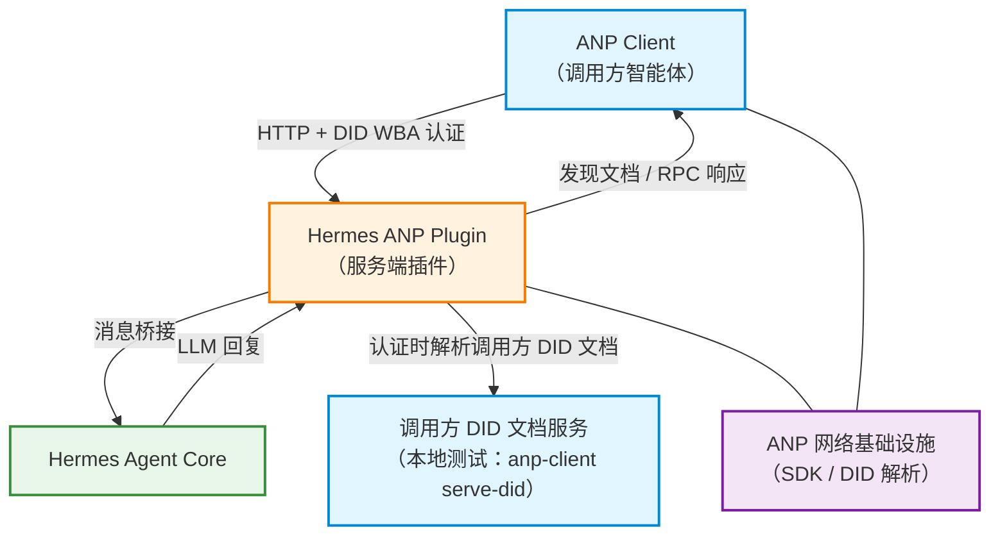

# 组件架构图

**图例**：蓝色 = 调用方（ANP Client / 调用方 DID 文档服务） · 橙色 = Hermes ANP Plugin（服务端） · 绿色 = Hermes Agent Core · 紫色 = 外部依赖

**说明**：DID WBA 认证要求服务端能解析到调用方的 DID 文档。本地测试中由 `anp-client serve-did`（默认 `127.0.0.1:18900`）托管，服务端通过 `ANP_DID_RESOLVER_BASE_URL` 指向它；生产环境则按 DID WBA HTTPS 规则从调用方公开地址解析，无需该角色。
