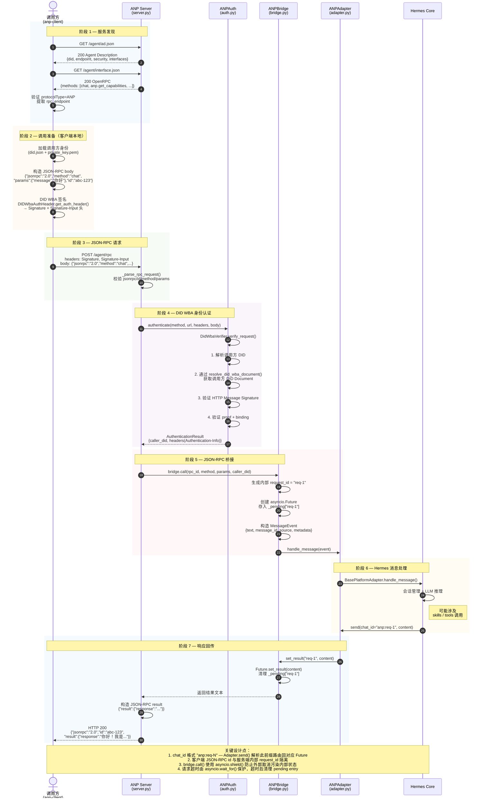

# 端到端调用时序图

**阶段说明**：
1. **服务发现**（步骤 1-3）— 调用方获取 Agent Description 和 OpenRPC，了解服务能力和接口
2. **调用准备**（步骤 4-5）— 客户端本地加载身份、构造请求、生成 DID WBA 签名
3. **JSON-RPC 请求**（步骤 6-7）— 签名请求到达服务端，首先做格式校验
4. **身份认证**（步骤 8-15）— 解析 DID 文档、验证签名和 proof，提取 caller DID
5. **桥接**（步骤 16-21）— 创建 Future、构造 MessageEvent、注入 Hermes 消息流
6. **LLM 处理**（步骤 22-25）— Hermes 核心消息处理管道（可能涉及 skills/tools）
7. **响应回传**（步骤 26-31）— Future 完成、构造 JSON-RPC 结果、返回调用方
