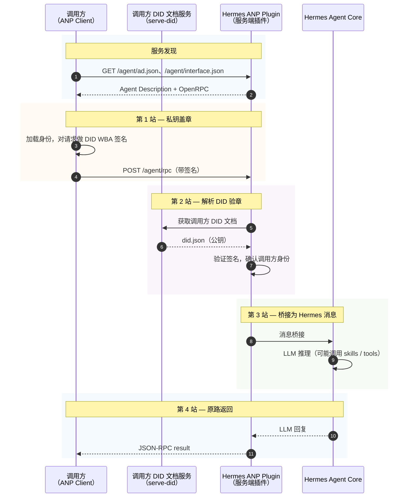

# 端到端调用时序图

```mermaid
sequenceDiagram
    autonumber
    participant Caller as 调用方<br/>（ANP Client）
    participant DID as 调用方 DID 文档服务<br/>（serve-did）
    participant Plugin as Hermes ANP Plugin<br/>（服务端插件）
    participant Hermes as Hermes Agent Core

    rect rgb(227, 242, 253, 0.4)
        Note over Caller,Plugin: 服务发现
        Caller->>Plugin: GET /agent/ad.json、/agent/interface.json
        Plugin-->>Caller: Agent Description + OpenRPC
    end

    rect rgb(255, 243, 224, 0.4)
        Note over Caller,Plugin: 第 1 站 — 私钥盖章
        Caller->>Caller: 加载身份，对请求做 DID WBA 签名
        Caller->>Plugin: POST /agent/rpc（带签名）
    end

    rect rgb(243, 229, 245, 0.4)
        Note over DID,Plugin: 第 2 站 — 解析 DID 验章
        Plugin->>DID: 获取调用方 DID 文档
        DID-->>Plugin: did.json（公钥）
        Plugin->>Plugin: 验证签名，确认调用方身份
    end

    rect rgb(232, 245, 233, 0.4)
        Note over Plugin,Hermes: 第 3 站 — 桥接为 Hermes 消息
        Plugin->>Hermes: 消息桥接
        Hermes->>Hermes: LLM 推理（可能调用 skills / tools）
    end

    rect rgb(227, 242, 253, 0.4)
        Note over Caller,Hermes: 第 4 站 — 原路返回
        Hermes-->>Plugin: LLM 回复
        Plugin-->>Caller: JSON-RPC result
    end
```

**阶段说明**（与社区演示的"四站路"口径一致）：

- **服务发现** — 调用方拿到名片（Agent Description）和说明书（OpenRPC），了解服务能力与接口
- **第 1 站：私钥盖章** — 客户端本地加载身份，用私钥对请求签名（HTTP Message Signatures）
- **第 2 站：解析 DID 验章** — 服务端从调用方 DID 文档服务取到公钥，验证签名、确认调用方身份
- **第 3 站：桥接** — 请求翻译成 Hermes 消息，进入核心处理管道，LLM 生成回复
- **第 4 站：原路返回** — 回复经桥接层回传，封装为 JSON-RPC result 返回调用方

注：本地测试中"调用方 DID 文档服务"即 `anp-client serve-did`（默认 `127.0.0.1:18900`）；生产环境按 DID WBA HTTPS 规则从调用方公开地址解析。实现细节（内部 request_id、超时与并发保护等）见 `plugins/anp-agent/anp_agent/` 源码。
